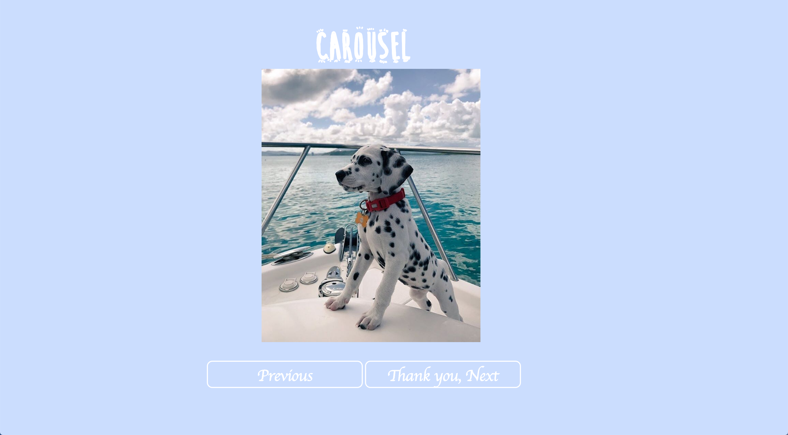

# My Awesome Carousel

Here we have a carousel of cute dog photos. All you have to do is click the "Thank u, next" and "previous" buttons to browse through the photos.

**Link to project:**

## How It's Made:

**Tech used:** HTML, CSS and JavaScript

I built this project by first creating an HTML document in order to create the headers, image tags and the button elements. Then I created the JavaScript file that will target the elements in my HTML file and give them functions. After I completed both the HTML and JavaScript I created a CSS file in order to style my site color, font styles etc.

## Lessons Learned:

With this particular project I was struggling to get the "previous" button to function properly, but with the help from fellow alumni I was able to figure out the solution.
