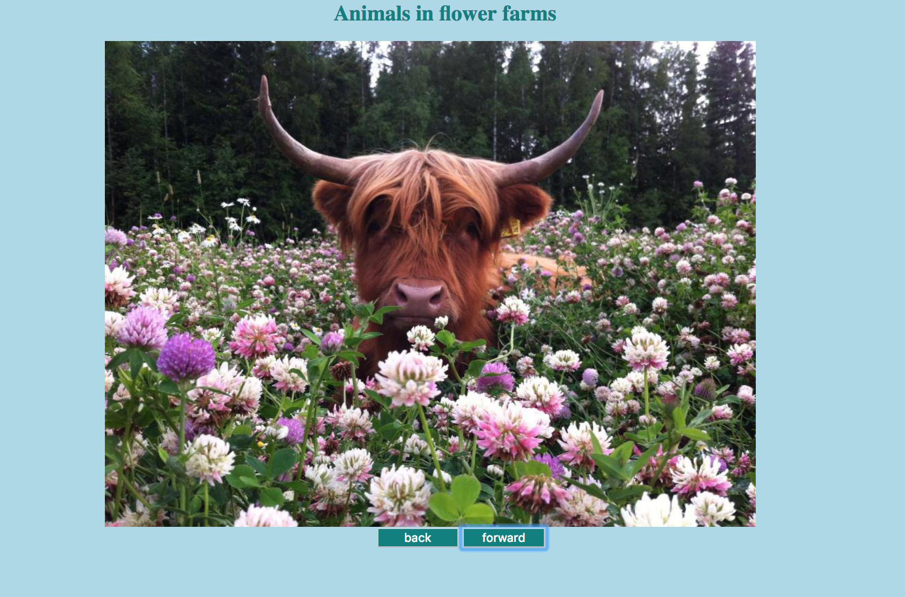

# IMAGE CAROUSEL PROJECT
This application allows users to move through 5 pictures starting at 1. Users can go forward and backward repeatedly with no end.

## How It's Made:

**Tech used:** HTML, CSS, JavaScript

## Optimizations
I would add a feature to allow a slow transition through the photos.

## Lessons Learned:

I learned how to display images using arrays and set a counter to track how many times users can move forward and backward through the images. 
